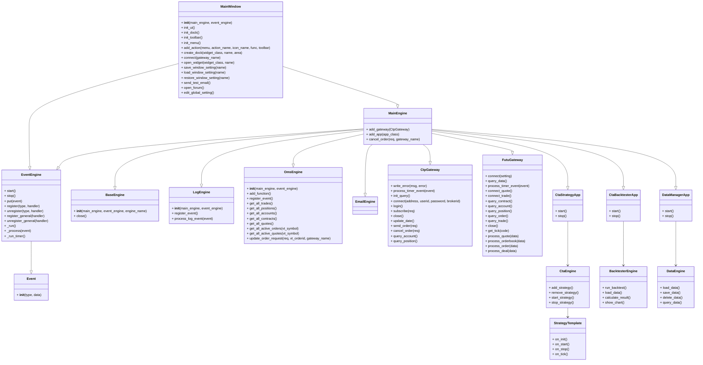

```mermaid
classDiagram
    class Event {
        + __init__(type, data)
    }

    class EventEngine {
        + start()
        + stop() 
        + put(event) 
        + register(type, handler)
        + unregister(type, handler)
        + register_general(handler) 
        + unregister_general(handler) 
        + _run()
        + _process(event)
        + _run_timer()
    }

    class MainEngine {
        + add_gateway(CtpGateway)
        + add_app(app_class)
        + cancel_order(req, gateway_name)
    }

    class BaseEngine {
        + __init__(main_engine, event_engine, engine_name)
        + close()
    }

    class LogEngine {
        + __init__(main_engine, event_engine)
        + register_event()
        + process_log_event(event)
    }

    class OmsEngine {
        + __init__(main_engine, event_engine)
        + add_function()
        + register_event()
        + get_all_trades()
        + get_all_positions()
        + get_all_accounts()
        + get_all_contracts()
        + get_all_quotes()
        + get_all_active_orders(vt_symbol)
        + get_all_active_quotes(vt_symbol)
        + update_order_request(req, vt_orderid, gateway_name)
    }

    class EmailEngine {
    }

    class CtpGateway {
        + write_error(msg, error)
        + process_timer_event(event)
        + init_query()
        + connect(address, userid, password, brokerid)
        + login()
        + subscribe(req)
        + close()
        + update_date()
        + send_order(req)
        + cancel_order(req)
        + query_account()
        + query_position()
    }

    class FutuGateway {
        + connect(setting)
        + query_data()
        + process_timer_event(event)
        + connect_quote()
        + connect_trade()
        + query_contract()
        + query_account()
        + query_position()
        + query_order()
        + query_trade()
        + close()
        + get_tick(code)
        + process_quote(data)
        + process_orderbook(data)
        + process_order(data)
        + process_deal(data)
    }

    class MainWindow {
        + __init__(main_engine, event_engine)
        + init_ui()
        + init_dock()
        + init_toolbar()
        + init_menu()
        + add_action(menu, action_name, icon_name, func, toolbar)
        + create_dock(widget_class, name, area)
        + connect(gateway_name)
        + open_widget(widget_class, name)
        + save_window_setting(name)
        + load_window_setting(name)
        + restore_window_setting(name)
        + send_test_email()
        + open_forum()
        + edit_global_setting()
    }

    class CtaStrategyApp {
        + start()
        + stop()
    }

    class CtaEngine {
        + add_strategy()
        + remove_strategy()
        + start_strategy()
        + stop_strategy()
    }

    class StrategyTemplate {
        + on_init()
        + on_start()
        + on_stop()
        + on_tick()
    }

    class CtaBacktesterApp {
        + start()
        + stop()
    }

    class BacktesterEngine {
        + run_backtest()
        + load_data()
        + calculate_result()
        + show_chart()
    }

    class DataManagerApp {
        + start()
        + stop()
    }

    class DataEngine {
        + load_data()
        + save_data()
        + delete_data()
        + query_data()
    }

    EventEngine --|> Event
    MainEngine --|> EventEngine
    MainEngine --|> BaseEngine
    MainEngine --|> LogEngine
    MainEngine --|> OmsEngine
    MainEngine --|> EmailEngine
    MainEngine --|> CtpGateway
    MainEngine --|> FutuGateway
    MainEngine --|> CtaStrategyApp
    MainEngine --|> CtaBacktesterApp
    MainEngine --|> DataManagerApp
    MainWindow --|> MainEngine
    MainWindow --|> EventEngine
    CtaStrategyApp --> CtaEngine
    CtaEngine --> StrategyTemplate
    CtaBacktesterApp --> BacktesterEngine
    DataManagerApp --> DataEngine
```

注册账号：186****2210
用户昵称：van
investorId： 230512
brokerId：9999
挂靠会员：SimNow